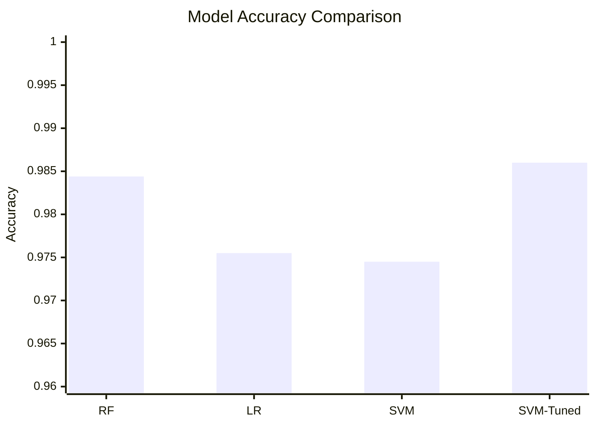

# Hand Gesture Recognition with MediaPipe + SVM

Real-time hand gesture classification using a webcam feed, MediaPipe hand landmarks, engineered geometric features, and a trained SVM model.

## Project Overview

This project detects one or two hands from a live camera stream, extracts hand landmarks, builds feature vectors, predicts gesture classes, and overlays the results on-screen in real time.

The repository includes:
- A full training workflow notebook (`Training_Process.ipynb`)
- Saved trained models (`models/*.pkl`)
- Real-time inference script (`video_processor.py`)
- Visualization utilities (`drawing.py`)
- MLflow helper for experiment tracking (`mlflow_utils.py`)

## How It Works

1. Capture frames from webcam using OpenCV.
2. Detect hand landmarks using MediaPipe Hands.
3. Recenter landmarks around wrist and normalize scale.
4. Build model features:
- 63 landmark values (`x, y, z` for 21 points)
- 5 joint-angle features (one per finger)
- 4 finger-spread angle features
5. Run SVM inference.
6. Smooth predictions using a short voting window.
7. Draw skeleton, bounding boxes, labels, and HUD on output.
8. Save annotated video to `output_recording.mp4`.

## Repository Structure

```text
Hand_Gesture_Project/
├── video_processor.py                  # Real-time inference + recording
├── drawing.py                          # Custom hand skeleton + annotation drawing
├── mlflow_utils.py                     # MLflow experiment/run helper
├── Training_Process.ipynb              # Data prep, feature engineering, training, evaluation
├── feature_names.txt                   # Inference feature order
├── requirements.txt                    # Python dependencies
├── models/
│   ├── SVM1.4_noZvalue_noStdScale_Angle_model.pkl
│   ├── SVM1_RawZ_NoRobScale.pkl
│   └── SVM1_RawZ_RobScale.pkl
└── .gitignore
```

## Installation

1. Clone the repository.
2. Create and activate a virtual environment.
3. Install dependencies:

```bash
pip install -r requirements.txt
```

## Run Real-Time Prediction

From the project root:

```bash
python video_processor.py
```

Controls:
- Press `q` to quit.

Output:
- Annotated window for live prediction.
- Recorded video saved as `output_recording.mp4`.

## Training Workflow (Notebook)

`Training_Process.ipynb` contains the end-to-end model-building pipeline:

- Load labeled landmark dataset (`hand_landmarks_data.csv`, excluded from repo)
- Rename and normalize coordinate features
- Add engineered angle/spread features
- Visualize distributions and class balance
- Split train/test with stratification
- Compare multiple models (Random Forest, SVM, Logistic Regression)
- Log runs with MLflow
- Tune SVM with GridSearchCV
- Save best model to `models/*.pkl`
- Export feature order to `feature_names.txt`

## Model Comparison

Results below are taken from `Training_Process.ipynb` test-set outputs.

| Model | Accuracy | Weighted F1 |
|---|---:|---:|
| Random Forest | 0.9844 | 0.9844 |
| Logistic Regression | 0.9755 | 0.9755 |
| SVM (baseline) | 0.9745 | 0.9745 |
| SVM (GridSearch tuned) | **0.9860** | **~0.9860** |



## Model and Feature Notes

- Inference currently loads:
  - `models/SVM1.4_noZvalue_noStdScale_Angle_model.pkl`
- Feature order is enforced with:
  - `feature_names.txt`
- Prediction smoothing uses a majority vote over the last 5 predictions per hand.

## Dependencies

Main packages:
- mediapipe
- opencv-python
- pandas
- scikit-learn
- mlflow
- matplotlib
- seaborn
- jupyter

## Important Files

- `video_processor.py`
  - Real-time camera loop
  - Feature extraction + SVM prediction
  - HUD drawing and recording
- `drawing.py`
  - Custom skeleton rendering
  - Bounding box + label drawing helpers
- `mlflow_utils.py`
  - Experiment setup and autologging helper
